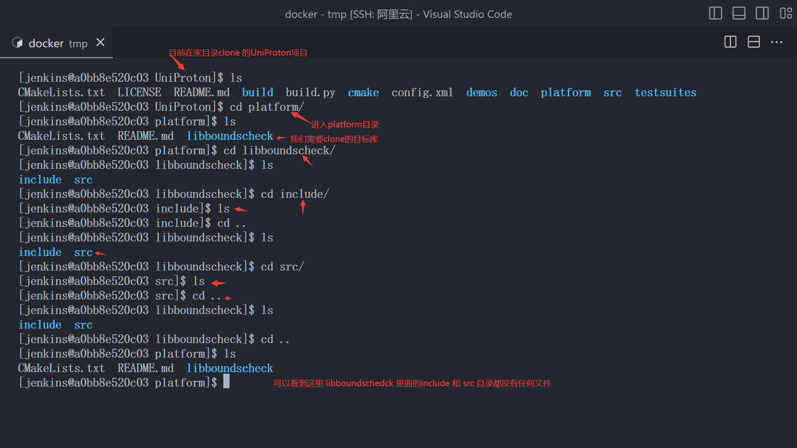
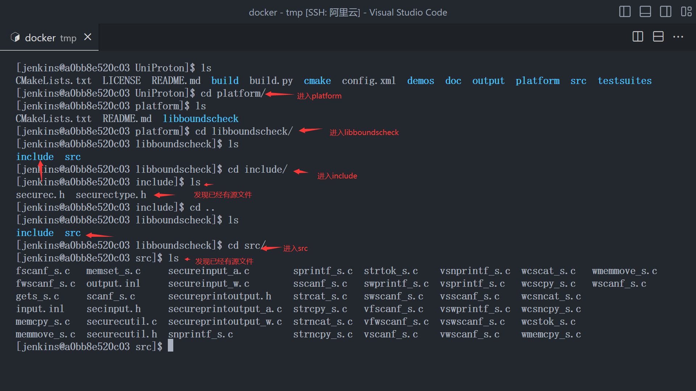
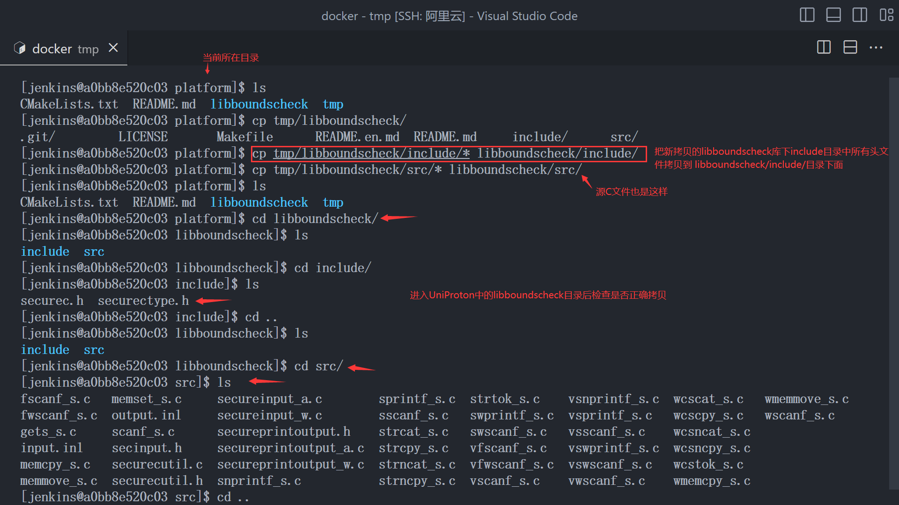
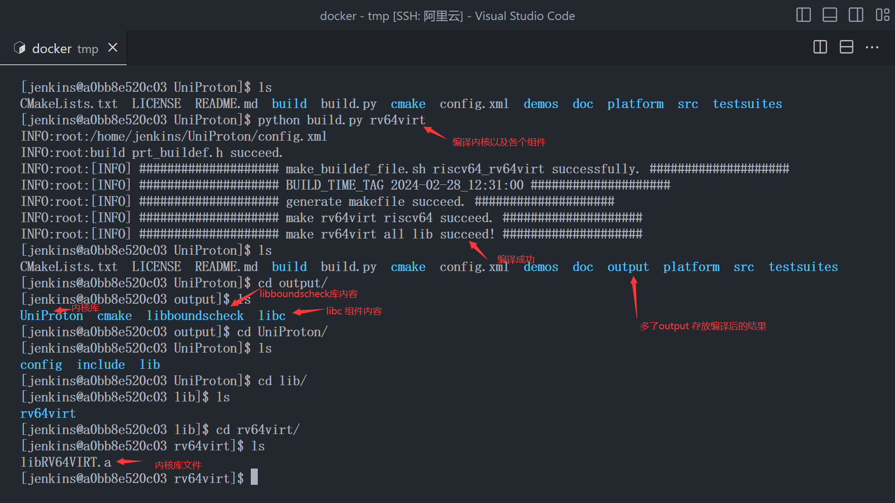
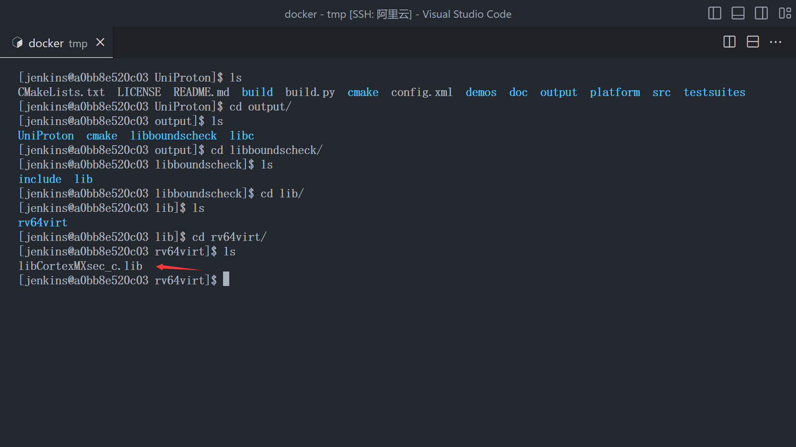
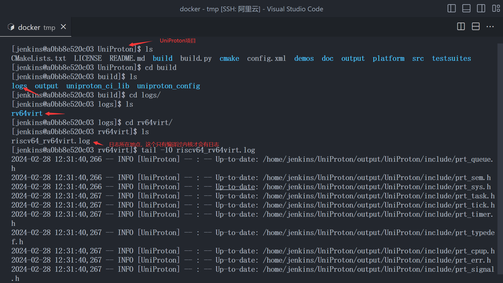
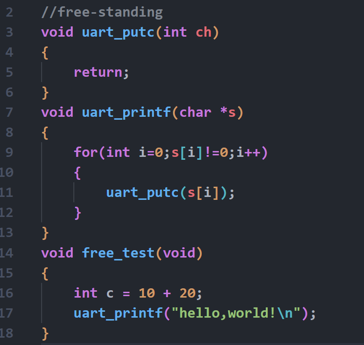
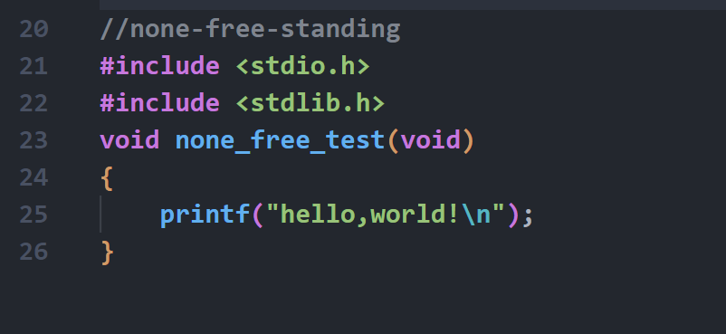

# UniProton构建流程

## [阅读前请确保搭建好环境](run_uniproton.md)

## 前言

## 正文

### 内核编译与demo编译的区别

#### 内核编译

- **demo 编译前必须执行内核编译，编译出对应的 libxx.a 的静态库文件后，作为demo可链接的库文件**

- **内核编译流程**

  - 拷贝内核依赖的字符串操作库[[一个 free-standing c 库](#什么是free-standing) ]到对应platform目录

  - **注：此处的UniProton是空白项目，若已经执行过 [demo编译](run_uniproton.md)，此处应该发现 libboundscheck内有对应的源文件**

  - 如果已经执行过 [demo编译](run_uniproton.md) ， 你可能会看到这种情况

  -  **如果发现是这种情况 请忽略 `下载libboundscheck 库文件 这个步骤`**

  - 下载libboundscheck 库文件

    - 进入 `~/UniProton/platform` 目录 **[这里假定UniProton项目被放置到 ~ 家目录下]**

      ```shell
      cd ~/UniProton/platform
      ```

    - 创建tmp 目录并clone libbouncscheck 仓库 , **这里由于的platform目录下已经有了 libboundscheck这个目录，为了防止出现重名，所以这样做**

      ```shell
      mkdir tmp && cd tmp
      git clone  https://gitee.com/openeuler/libboundscheck
      ```

    - **将拷贝的 libboundscheck 仓库中的 include/* 和 src/* 拷贝到UniProton 仓库对应目录然后删除 tmp 目录**

    - **记得在完成拷贝后删除 tmp目录**

  - 执行内核编译

    - 回到UniProton主目录 **[这里假定UniProton项目被放置到 ~ 家目录下]**

      ```shell
      cd ~/UniProton
      ```

    - 执行编译

      ```shell
      python build.py rv64virt
      ```

  - 检查是否生成 libxx.a 的内核库文件以及其他库文件

  - 这是kernel库文件

  - 这是libboundscheck字符串库文件

  - **库文件只有如上两个，libc 组件已经作为内核的组件出现在 libRV64VIRT.a 中，编译出的libc 只是给用户使用的 接口头文件**

#### demo编译

- [demo编译](run_uniproton.md)脚本执行的内容
  - clone libboundscheck 库
  - 编译出 两个库文件
  - 把两个库文件拷贝到demo 目录对应的 lib目录
  - 编译APP工程
  - 把所有 .o 链接起来，生成可执行ELF文件

### 阅读内核编译日志

**注： 只有编译过内核才会出现日志** 

若想要清理编译结果

**在UniProton主目录下执行**

```rv64virt
python build.py clean
```


## QA

### 什么是free-standing

不依赖于任何库文件或者只依赖free-standing的库文件，不依赖于任何软件运行环境【如python】，只依赖于硬件环境和编译器的代码。

free-standing c code



none-freestanding c code


