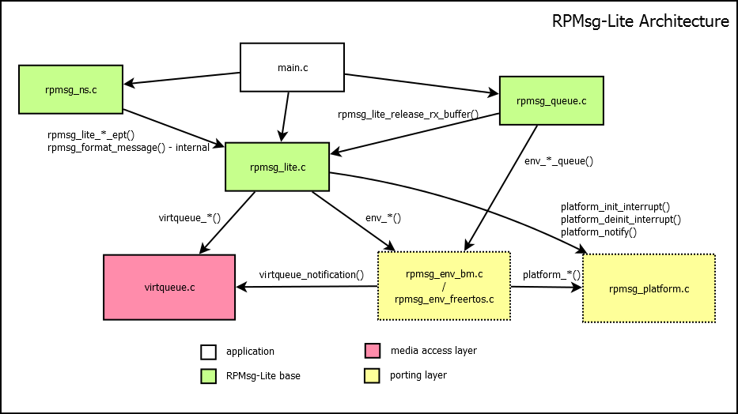

# UniProton 子模块——RPMsg-lite

## 目录
- 1.[子模块目录结构](#子模块目录结构)
- 2.[代码结构概述](#代码结构)
  - 2.1[include目录](#include目录)
  - 2.2[RPMsg-lite源文件](#rpmsg-lite源文件)
    - 2.2.1[RPMsg layer](#rpmsg-layer-rpmsg_litensqueuec绿色)
    - 2.2.2[MAC layer](#rpmsg-mac介质访问控制层-layer-virtqueuec红色)
    - 2.2.3[RPMsg-lite port layer](#rpmsg-mac介质访问控制层-layer-virtqueuec红色)
- 3.[子模块维护者](#子模块维护者)
- 4.[*相关文档](#子模块文档)
  - 4.1[外部文档（包括技术分享）](#外部文档)
  - 4.2[内部文档](#内部文档)

## 子模块目录结构

```
源码目录
src/component/rpmsglite
├── CMakeLists.txt
├── include
│   ├── llist.h
│   ├── rpmsg_compiler.h
│   ├── rpmsg_config.h
│   ├── rpmsg_default_config.h
│   ├── rpmsg_env.h
│   ├── rpmsg_env_specific.h
│   ├── rpmsg_lite.h
│   ├── rpmsg_ns.h
│   ├── rpmsg_platform.h
│   ├── rpmsg_queue.h
│   ├── virtio_ring.h
│   └── virtqueue.h
├── llist.c
├── rpmsg_env_uniproton.c
├── rpmsg_lite.c
├── rpmsg_ns.c
├── rpmsg_platform.c
├── rpmsg_queue.c
└── virtqueue.c

.../project
├── rpmsg_platform_${arch}.c
```
## 代码结构
### include目录
  - 包含所有RPMsg-lite的头文件
  - 在编译RPMsg-lite模块和**任何需要调用RPMsg-lite API的程序**时都需要引用该目录下的头文件
  - 需要注意rpmsg_config.h，它是RPMsg-lite的配置文件，有一些重要的特性如,**自定义shmem配置**（目前Uniproton默认开启特性）,**每个rpmsglite buffer的大小**等。这些配置都是在rpmsg_config.h中静态定义的。
### RPMsg-lite源文件

  - 其中绿色是传输层，也是直接暴露给用户的接口
  - 红色是MAC(访问介质控制层)，基于virqueue实现，用于管理share memory
  - 黄色是移植层，是移植RPMsg-lite时主要需要关心的文件
#### RPMsg layer （rpmsg_lite/ns/queue.c（绿色））
  - 这三个文件是RPMsg-lite对用户提供的API，提供用户直接调用的接口
    - rpmsg_lite.c是RPMsg-lite通信的核心接口，实现了端到端的异步通信
    - rpmsg_ns.c是在rpmsg_lite.c上的二次封装，实现了RPMsg-lite设备注册和移除在OS间的通知
    - rpmsg_queue.c同样是在rpmsg_lite.c上的二次封装，在异步通信的基础上实现了基于队列的同步通信机制，**是RPMsg-lite最常用的通信机制**。
#### RPMsg MAC（介质访问控制层） layer （virtqueue.c（红色））
  - RPMsg-lite使用virqueue结构管理共享内存。该文件实现了virqueue相关接口（rpmsglite使用的是**split virqueue**（virqueue spec version 1.0及之前的版本），目前virqueue spec 1.3中提出了更高效的**pack queue**）。
#### RPMsg-lite port layer （rpmsg_env_uniproton/platform.c（黄色））
  - rpmsg_env_uniproton用于对接OS/Baremental环境，包括内存申请，线程休眠和消息队列实现等。
  - rpmsg_platform用于对接arch+board，主要需要实现**核间中断（IPI）和跨OS的share memory地址翻译**。
  - 在Uniproton上，为了简化编译逻辑，**源码目录下的platform文件仅提供以WEAK声明的空实现**，实际的platform文件必须在编译项目时提供（即**project目录下的rpmsg_platform_${arch}.c文件**）。

## 子模块维护者

- 李金哲@Mechanicu
- ......  

## 子模块文档
### 外部文档
- [openAMP项目](https://www.openampproject.org/)
  - openAMP项目目标是制定AMP（异构多核）环境下核间通信的标准，RPMsg协议就是其产物之一（主要定位是实现Linux与其它OS间的通信）
- [RPMsg-lite github仓库](https://github.com/nxp-mcuxpresso/rpmsg-lite)
  - NXP的轻量级RPMsg协议实现，与openAMP侧重不同，主要服务于MCUs环境下RTOS+RTOS的通信
  - 仓库下有NXP官方的RPMsg-lite API说明文档。
- [Uniproton gitee仓库](https://gitee.com/openeuler/UniProton)
- [openEuler技术分享：在Uniproton on QEMU RISC-V上基于RPMsg-lite进行核间通信](https://www.bilibili.com/video/BV1LZ421p7Bz)
- [openEuler技术分享：Uniproton on QEMU RISC-V系列教学](https://www.bilibili.com/video/BV1Ut421c7FV)
### 内部文档
- [RPMsg-lite在Uniproton + QEMU RISC-V上的移植](./RPMsg-lite_Port/Porting_RPMsg-lite_on_Uniproton_on_QEMU_RISC-V.md)
- [RPMsg协议栈（1）——物理层设计](./RPMsg_Protocol/RPMsgProtocol1_physical_layer.md)
- [RPMsg协议栈（2）——MAC层设计](./RPMsg_Protocol/RPMsgProtocol2_MAC_layer.md)
- [RPMsg协议栈（3）——传输层设计](./RPMsg_Protocol/RPMsgProtocol3_transport_layer.md)