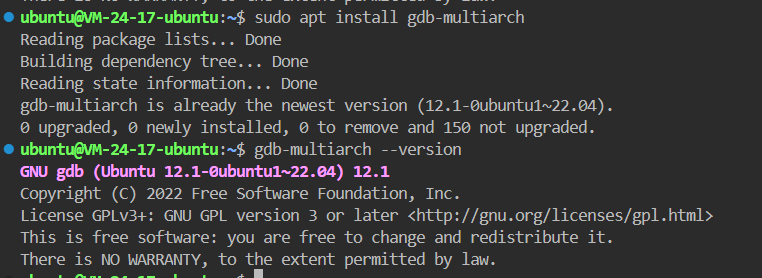
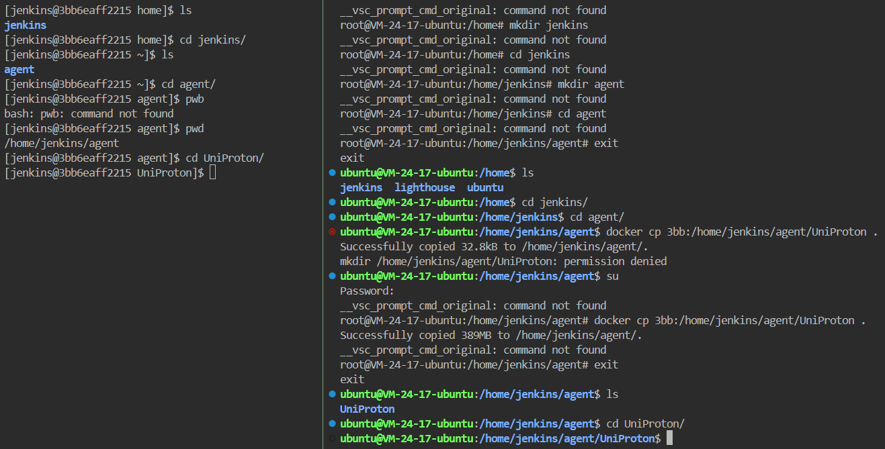
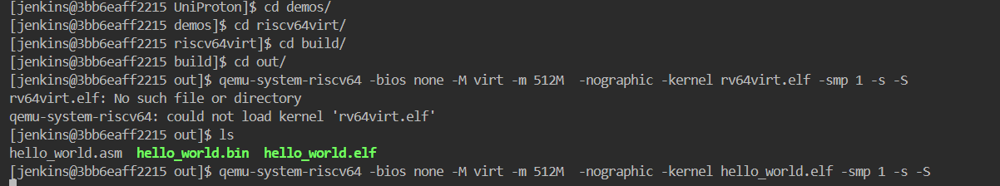
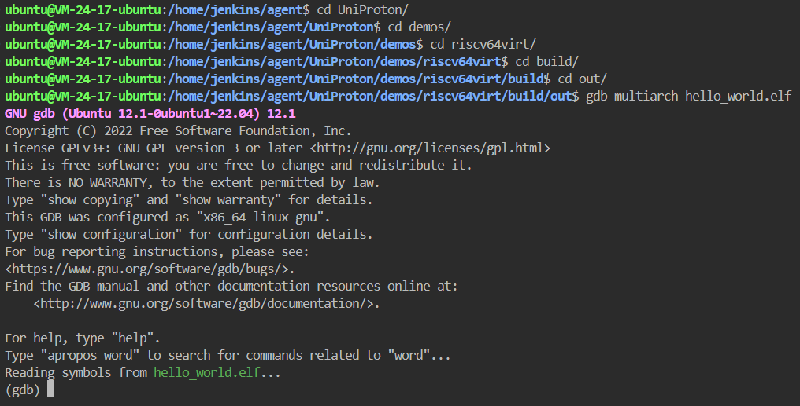
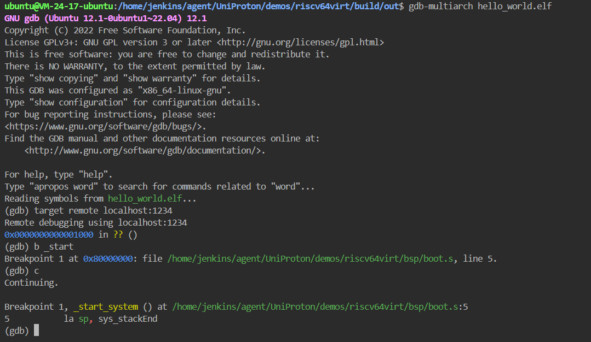
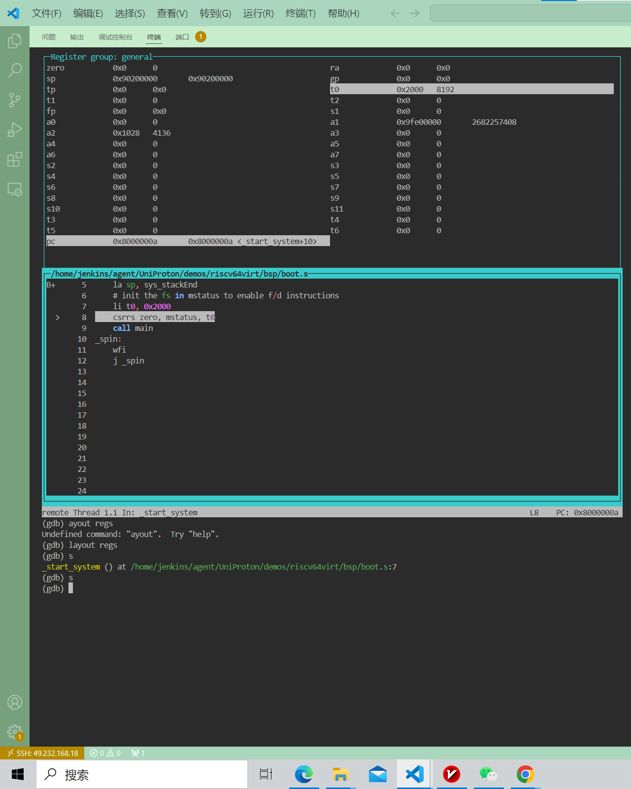
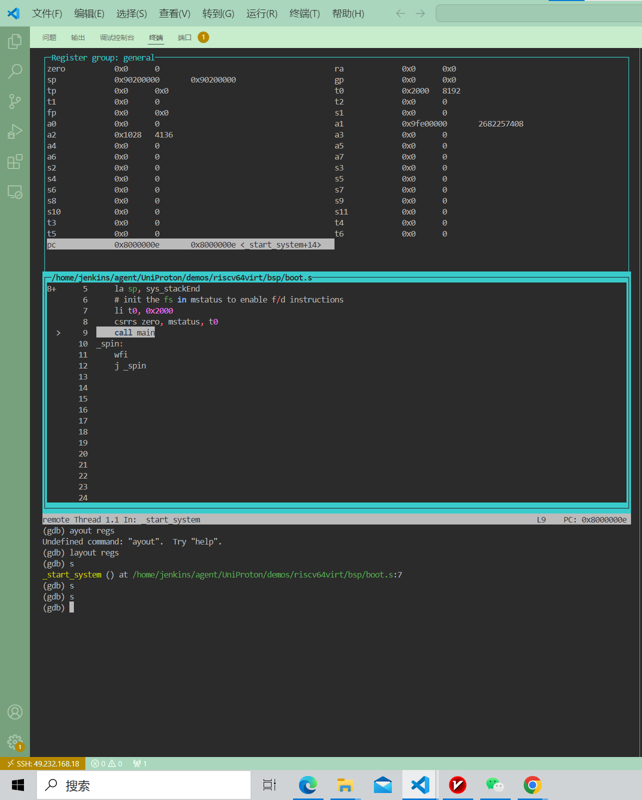

# vscode + qemu + gdb 远程调试 UniProton risc-v

## 环境配置

- 根据链接搭建docker下的UniProton环境 [qemu-system-riscv64上运行 UniProton](https://github.com/Jer6y/oerv-rtos/blob/main/doc/run_uniproton.md)

- 作者主机环境：Ubuntu 22.04

## 正文

### 配置调试环境

- 在主机安装 gdb-multiarch

  - 执行sudo apt install gdb-multiarch安装 gdb-multiarch 并执行 gdb-multiarch --version 进行验证

    - 

- 配置 docker 环境

  - 在docker环境下执行 docker run -p 1234:1234 -itd [docker镜像id] /bin/bash 创建镜像容器

    - 将容器的 1234 端口映射到宿主机的 1234 端口，允许通过宿主机的 1234 端口访问容器中的服务，为 gdb 远程调试 docker 下的 UniProton 提供基础

  - 执行 docker exec -it [docker容器id] /bin/bash 连接 docker 容器

  - 根据环境配置所给的链接内的教程编译出 UniProton riscv demo
 
- 配置主机环境

  - 执行 docker cp [容器id]:[文件路径] . 将docker下编译好的 UniProton riscv demo 文件复制到主机当前目录下，要确保路径相同
     
    - 因为在docker和宿主机的编译环境路径不同，所以需要将在docker下编译好的demo复制到主机目录下 

    - 

### 调试    

- 在 docker 容器内使用 qemu 启动 riscv demo

  - 执行 qemu-system-riscv64 -bios none -M virt -m 512M  -nographic -kernel rv64virt.elf -smp 1 -s -S 启动

    - -s选项用于使模拟器监听端口1234上的gdb连接

    - -S选项用于阻止模拟器立即运行程序，而是等待gdb连接

    - 其他选项环境配置所给出的链接内容有讲解
    
    - 

- 在主机的相同目录下启动 gdb-multiarch

  - 执行 gdb-multiach hello_world.elf 启动 gdb 调试

    - 

- 调试

  - 执行 target remote localhost:1234 连接端口

  - 执行b start 打断点打在入口位置

  - 执行c 执行到入口位置
 
    - 

  - 执行layout regs 显示源代码和CPU寄存器窗口，方便观察寄存器变化

    - 

  - 执行到main 到达程序主入口

    - 

    

     

