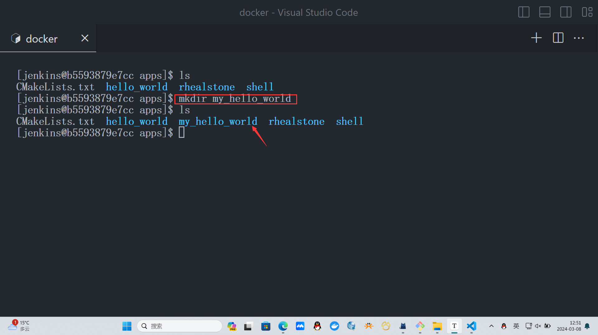
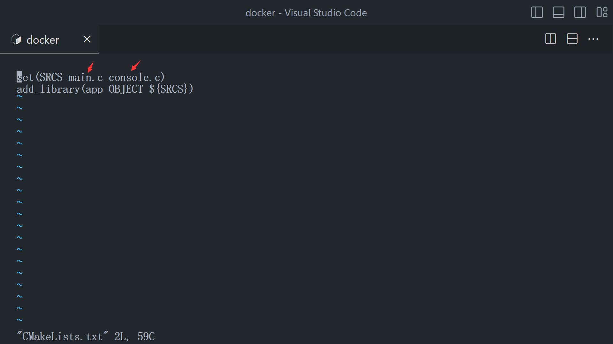
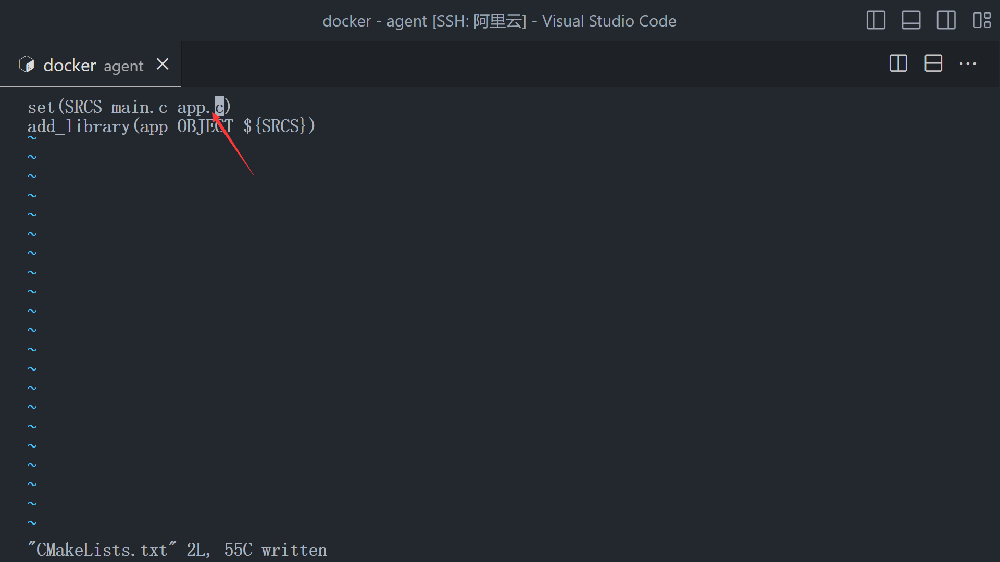
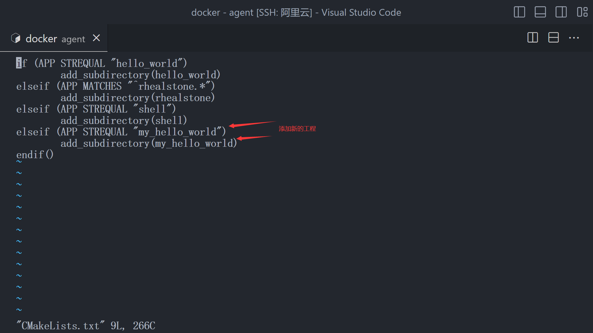
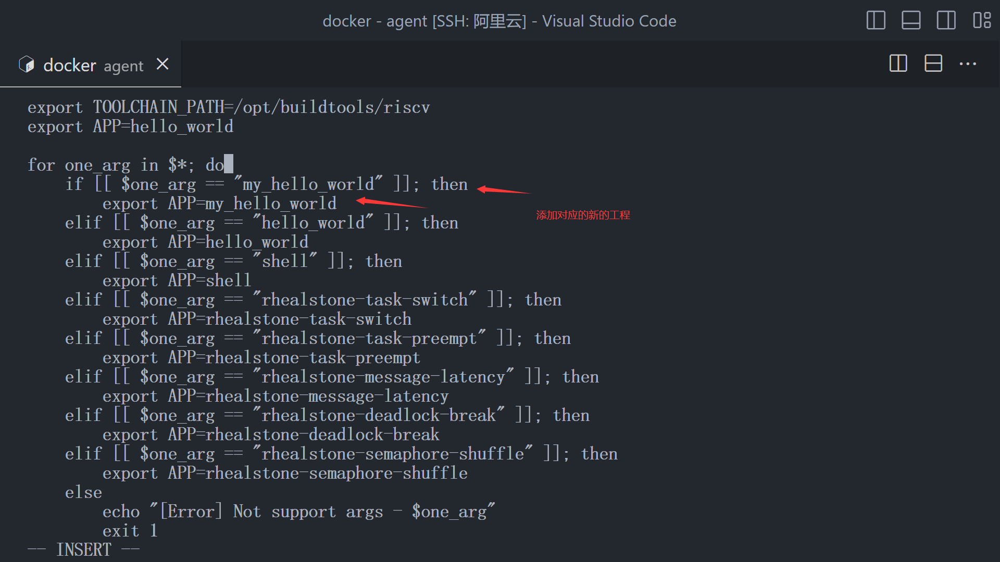
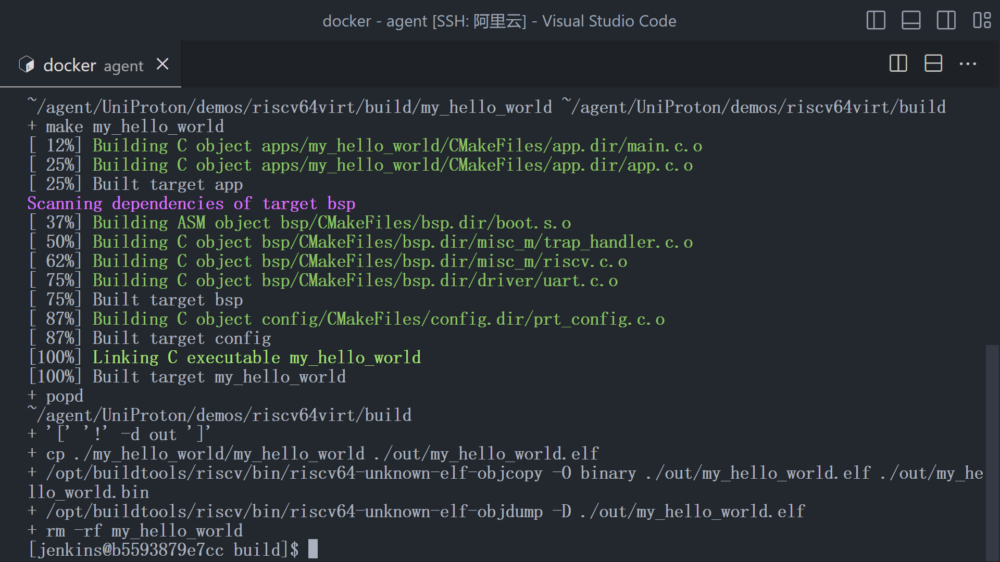
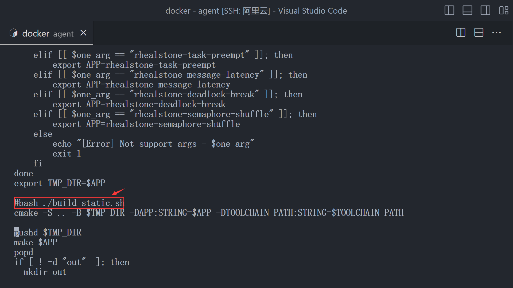
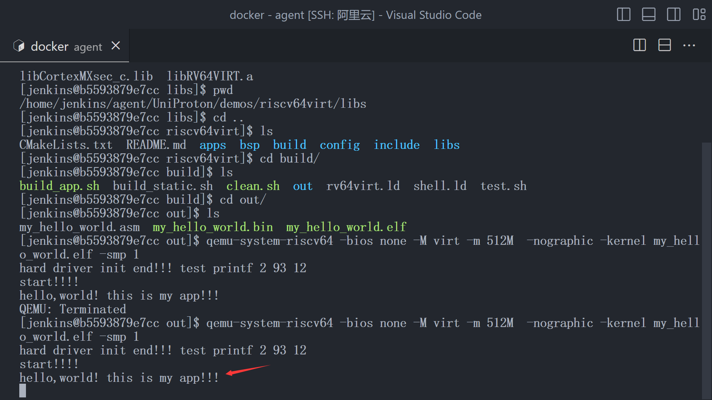

# UniProton - 内核CORE API实战

## 前言

- **请完成基本UniProton运行环境的搭建！**
- **请完成构建系统的流程和观测！**

- 在完成基本环节和构建之后，已经初步体验了 UniProton RTOS
- 现在需要正式的去了解，我们到底应该如何使用CORE API进行开发，同时通过CORE API 去理解整个内核
- **本文档会长期更新，未来可能不会止步于 CORE API 会讲到一些,各个组件的用户API实战**

## 正文

### 基础应用流程

#### 1. 创建新的APP工程

- 进入`UniProton/demos/riscv64virt` 目录，可以看到目录

  - ```shell
    | - CMakeLists.txt
    | - apps
    |    | - hello_world
    |         |- ...
    |    | - ...
    |    | - CMakeLists.txt
    | - bsp
    |    | - CMakeLists.txt
    |    | - ...
    | - lib
    |    | - ...
    | - build
    |    | - CMakeLists.txt
    |    | - ...
    | - config 
    |    | - ...
    | - include
    |    | - ...
    | - ...
    ```

  - 其中 `app` 目录 是我们需要关注的目录，我们所有的应用开发都会在APP目录上进行

  - `bsp` 目录存放了一些 virt 板载相关的驱动，如 uart驱动代码，以及平台相关的信息，包括时钟的频率等，UART的IRQ中断号等都可以从中获得或者添加

  - `lib`  目录用于存放 UniProton内核和其他基本组件的静态库， **不用关心**

  - `build` 目录存放一些构建的脚本，在[运行UniProton](run_uniproton.md)的篇章中也有使用过 

  - `config` 目录用于存放一些配置相关的文件

  - `include ` 用于存放内核CORE API的头文件

-  进入 `apps` 目录，创建**新的工程目录** `my_hello_world`

  - 不必在意我创建的其他工程，可能与你的不一样，关注于`my_hello_world目录`

  - 将初始工程`hello_world` 里的 `CMakeLists.txt` 拷贝到 `my_hello_world` 下去

  - 最终你的工程应该是下面的结构

  - ```shell
    | - apps
    | - my_hello_world
    |    | - CMakeLists.txt
    | - ...
    ```

  - 修改工程内的 CMakeLists.txt ，注意是 `my_hello_world`工程目录内的

  - 根据自己的需求添加对应的源C文件，这里我们需要把console.c删除，因为我们没有用到,  同时我们也要添加`main.c`

  - 添加`main.c` 文件 ，写入下面的代码

  - ```c
    /*
     * Copyright (c) 2024-2024 Huawei Technologies Co., Ltd. All rights reserved.
     *
     * UniProton is licensed under Mulan PSL v2.
     * You can use this software according to the terms and conditions of the Mulan PSL v2.
     * You may obtain a copy of Mulan PSL v2 at:
     *          http://license.coscl.org.cn/MulanPSL2
     * THIS SOFTWARE IS PROVIDED ON AN "AS IS" BASIS, WITHOUT WARRANTIES OF ANY KIND,
     * EITHER EXPRESS OR IMPLIED, INCLUDING BUT NOT LIMITED TO NON-INFRINGEMENT,
     * MERCHANTABILITY OR FIT FOR A PARTICULAR PURPOSE.
     * See the Mulan PSL v2 for more details.
     * Create: 2024-02-22
     * Description: main函数入口,初始化内核
     */
    #include "prt_task.h"
    #include "prt_config.h"
    #include "prt_typedef.h"
    #include "os_cpu_riscv64.h"
    #include "riscv.h"
    #include "platform.h"
    #include "uart.h"
    
    // 初始配置函数入口
    extern S32 OsConfigStart(void);
    
    // 用户可以使用的接口，需要写入mtvec
    extern void trap(); 
    
    void OsHwInit()
    {
        w_mstatus(r_mstatus() & (~MIE));
        w_mie(r_mie() | MEIE | MSIE | MTIE);
        U64 x = (U64)trap;
        OS_EMBED_ASM("csrw mtvec, %0"::"r"(x):);
        //w_mtvec((U64)trap);
        U64 coreId = PRT_GetCoreID();
        U64 nowTime = *(U64 *)CLINT_TIME;
        *(U64* )CLINT_TIMECMP(coreId) = (nowTime + OS_TICK_PER_SECOND);    
    }
    
    U32 PRT_HardDrvInit(void)
    {
        uart_init(NULL);
        uart_printf("hard driver init end!!! test printf %d %p %x\n",2,0x93,0x12);
        return OS_OK;
    }
    
    U32 PRT_AppInit(void)
    {
        // app 初始化代码
        return OS_OK;
    }
    
    int main()
    {
        return OsConfigStart();
    }
    
    extern void *__wrap_memset(void *dest, int set, U32 len)
    {
        if (dest == NULL || len == 0) {
            return NULL;
        }
        
        char *ret = (char *)dest;
        for (int i = 0; i < len; ++i) {
            ret[i] = set;
        }
        return dest;
    }
    
    extern void *__wrap_memcpy(void *dest, const void *src, size_t size)
    {
        for (size_t i = 0; i < size; ++i) {
            *(char *)(dest + i) = *(char *)(src + i);
        }
        return dest;
    }
    
    ```

  - **不用注意其他的初始化的内容**，集中注意力到 `PRT_APPInit(void)` 这个函数上面去，我们需要将我们APP的初始化代码放到这里面去，你可以初始化一个线程，为其分配栈空间，或者做其他事情，**这里我建议**： 把 `PRT_AppInit`的代码换成如下的代码[后续也是按照这个思路写教程的]

    ```c
    TskHandle g_pid; //这个全局变量必须要添加
    U32 PRT_AppInit(void)
    {
        struct TskInitParam para;
        extern void APP_Entry(uintptr_t param1, uintptr_t param2, uintptr_t param3, uintptr_t param4);
        para.taskEntry = APP_Entry;
        para.taskPrio = 25;
        para.stackSize = 0x1000;
        para.name ="app entry";
        para.stackAddr = 0;
        para.args[0] = 0;
        para.args[1] = 0;
        para.args[2] = 0;
        para.args[3] = 0;
        
        if(PRT_TaskCreate(&g_pid,&para) != OS_OK) {
            uart_putstr_sync("err in prt_task_create");
            while(1) {
                OS_EMBED_ASM("wfi");
            }
        }
        if(PRT_TaskResume(g_pid) != OS_OK ) {
            uart_putstr_sync("err in prt_task_resume");
            while(1) {
                OS_EMBED_ASM("wfi");
            }
        }
        return OS_OK;
    }
    ```

  - 上面的**APP初始化就是干的一件事情**，**创建一个线程**，线程指定入口为 **APP_Entry** ，优先级为25 分配的栈空间为0x1000 字节 

  - 然后恢复这个线程，【这是UniProton Core 定义的 所有线程在**创建之后都是阻塞态** 必须**先使用 Core API 恢复**】

  - 请注意，你的**APP_Entry 线程**的栈空间只有 0x1000 字节，**务必保证不要栈溢出，因为运行在M态没有内存保护**

  - 创建真正的 **app 文件** , 在 `my_hello_world` 工程下面创建 `app.c` 文件, 这是你的真正的APP代码

  - 请务必保证有APP的入口 **void APP_Entry(uintptr_t param1, uintptr_t param2, uintptr_t param3, uintptr_t param4);**

  - 我的APP初始化代码如下

    ```c
    #include "uart.h"
    
    void APP_Entry(uintptr_t param1, uintptr_t param2, uintptr_t param3, uintptr_t param4)
    {
      uart_printf("hello,world! this is my app!!!\n");
      return ;
    }
    ```

  - 然后是把刚才创建的 app.c 添加到CMakeLists.txt里面，参与真实的编译

  - 这是**my_hello_world** 工程里面的 CMakeLists.txt

  - 返回到 apps 目录，我们需要把 my_hello_world 新的工程项目添加起来,所在目录应该为 `UniProton/demos/riscv64virt/apps`

  - 编辑 CMakeLists.txt

  - 不必在意你没有的其他工程，按照格式添加对应工程目录即可

  - 进入 build 目录，所在的路径为 `UniProton/demos/riscv64virt/build` 修改 `build_app.sh`文件

  - 这里按照对应格式添加 my_hello_world 工程 即可

  - 保存退出，在`UniProton/demos/riscv64virt/build` 路径下执行 `sh -x -e  build_app.sh my_hello_world`

  - 构建成功

  - **注意，如果我们只修改了 app 的代码，并没有修改内核的代码，是不用去重新编译 内核的，但是每次编译都会重新编译内核，所以，如果执行过一次 内核的编译了，只需要把 `build_app.sh` 中的下列内容注释掉**

  - 注释这一行

  - 如何判断自己有没有编译出 kernel 的静态库？ 查看`UniProton/demos/riscv64virt/libs` 如果存在对应的两个静态库文件则为编译出过

  - 验证运行我们编译出的ELF，查看是否会打印出 hello,world，结果成功！

  - 


 